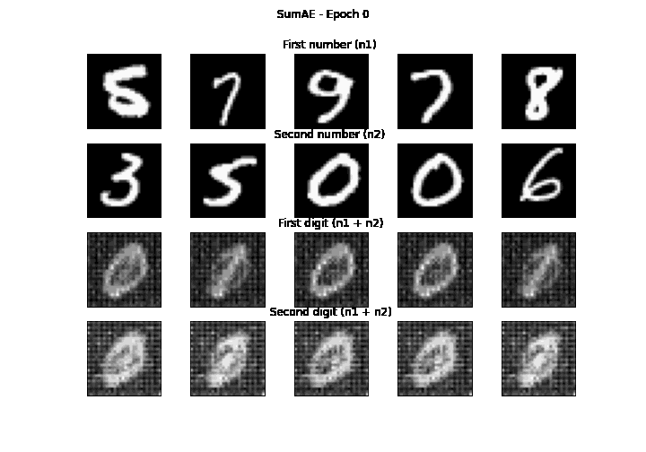

# SumAE

An Autoencoder to sum two MNIST images





## Built With

* [Python 3.10](https://www.python.org)
* [PyTorch](https://pytorch.org/)
* [Matplotlib](https://matplotlib.org/)
* [Scikit Learn](https://scikit-learn.org/stable/) 

## Getting Started
If you want run *SumAE* I suggest to use an Ubuntu 20.04 machine. All you have to do is running the following commands:

```
conda env create --file environment.yml
jupyter notebook
```

Now you can run the notebook __main.ipynb__ and watch the magic.

## Usage

Check ***main.ipynb*** for usage.
